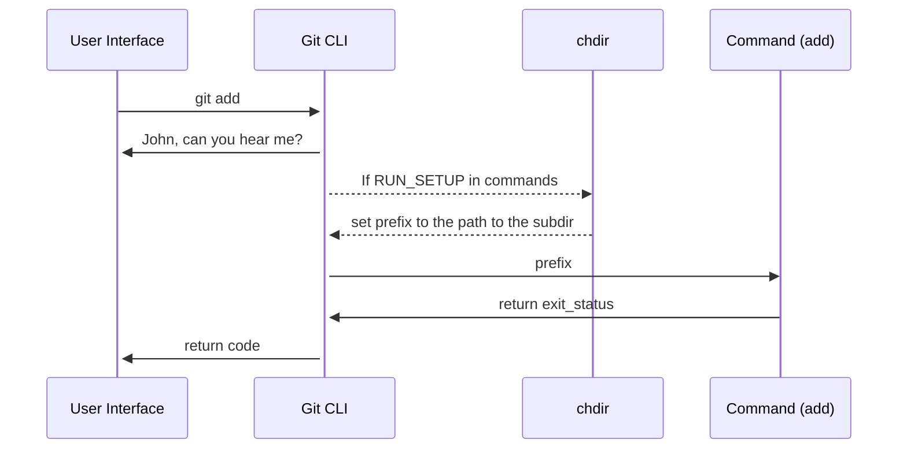

In this document, we will learn how to add a command to Git's CLI.

# Runtime Environment

Git subcommands are standalone executables that live in the Git exec path, normally `/usr/lib/git-core`. The `git` executable itself is a thin wrapper that knows where the subcommands live, and runs them by passing command-line arguments to them.

# Adding a new command

<SwmSnippet path="/my_builtin/add.c" line="472">

---

Every command has a file with a corresponding name, within the <SwmPath>[my_builtin](/my_builtin)</SwmPath> folder.

This file includes the definition of the command (in this case <SwmToken path="/my_builtin/add.c" pos="475:2:2" line-data="int cmd_add(int argc, const char **argv, const char *prefix)">`cmd_add`</SwmToken>:

```c
int cmd_add(int argc, const char **argv, const char *prefix)
{
	int exit_status = 0;
	struct pathspec pathspec;
```

---

</SwmSnippet>

<SwmSnippet path="/builtin.h" line="111">

---

The function must be declared within <SwmPath>[builtin.h](/builtin.h)</SwmPath>:

```c
int cmd_add(int argc, const char **argv, const char *prefix);
```

---

</SwmSnippet>

<SwmSnippet path="/git.c" line="481">

---

To make Git “aware” of the <SwmToken path="/git.c" pos="485:4:4" line-data="	{ &quot;add&quot;, cmd_add, RUN_SETUP | NEED_WORK_TREE },">`add`</SwmToken> command, it needs to be registered by adding a <SwmToken path="/git.c" pos="484:4:4" line-data="static struct cmd_struct commands[] = {">`cmd_struct`</SwmToken> to the <SwmToken path="/git.c" pos="484:6:6" line-data="static struct cmd_struct commands[] = {">`commands`</SwmToken> array:

```c
static struct cmd_struct commands[] = {
	{ "add", cmd_add, RUN_SETUP | NEED_WORK_TREE },
```

---

</SwmSnippet>

&nbsp;

<SwmSnippet path="/Makefile" line="1063">

---

Also, in order to be able to build the project, we must add our command into the <SwmToken path="/Makefile" pos="1063:0:0" line-data="BUILTIN_OBJS += builtin/add.o">`BUILTIN_OBJS`</SwmToken> within the <SwmPath>[Makefile](/Makefile)</SwmPath>:

```
BUILTIN_OBJS += builtin/add.o
```

---

</SwmSnippet>

# Tests

You must have a test, written to report in TAP (Test Anything Protocol). Tests are executables (usually shell scripts) that live in the <SwmPath>[t](/t)</SwmPath>subdirectory of the tree. Each test name begins with `t` and a sequence number that controls where in the test sequence it will be executed.

<SwmSnippet path="/t/t3700-add.sh" line="429">

---

&nbsp;

This is an example of a test for the <SwmToken path="/builtin.h" pos="114:2:2" line-data="int cmd_add(int argc, const char **argv, const char *prefix);">`cmd_add`</SwmToken> command:

```shell
test_expect_success 'no file status change if no pathspec is given' '
	>foo5 &&
	>foo6 &&
	git add foo5 foo6 &&
	git add --chmod=+x &&
	test_mode_in_index 100644 foo5 &&
	test_mode_in_index 100644 foo6
```

---

</SwmSnippet>

# Show your command

<SwmSnippet path="/command-list.txt" line="47">

---

In <SwmPath>[command-list.txt](/command-list.txt)</SwmPath> we categorize commands by type, so they can be listed in appropriate subsections in the documentation's summary command list. Add an entry for yours.

```text
# command name                          category [category] [category]
git-add                                 mainporcelain           worktree
```

---

</SwmSnippet>

# How your new command is called

The implementation commands take three parameters: <SwmToken path="/my_builtin/add.c" pos="475:6:6" line-data="int cmd_add(int argc, const char **argv, const char *prefix)">`argc`</SwmToken>, <SwmToken path="/builtin.h" pos="114:14:14" line-data="int cmd_add(int argc, const char **argv, const char *prefix);">`argv`</SwmToken>, and <SwmToken path="/builtin.h" pos="114:22:22" line-data="int cmd_add(int argc, const char **argv, const char *prefix);">`prefix`</SwmToken>. The first two are similar to what `main()` of a standalone command would be called with.

When <SwmToken path="/git.c" pos="485:11:11" line-data="	{ &quot;add&quot;, cmd_add, RUN_SETUP | NEED_WORK_TREE },">`RUN_SETUP`</SwmToken> is specified in the <SwmToken path="/git.c" pos="484:6:6" line-data="static struct cmd_struct commands[] = {">`commands`</SwmToken> table, and when you were started from a subdirectory of the work tree, your new command (e.g., <SwmToken path="/builtin.h" pos="114:2:2" line-data="int cmd_add(int argc, const char **argv, const char *prefix);">`cmd_add`</SwmToken> is called after `chdir` to the top of the work tree, and <SwmToken path="/my_builtin/add.c" pos="475:22:22" line-data="int cmd_add(int argc, const char **argv, const char *prefix)">`prefix`</SwmToken> gets the path to the subdirectory the command started from. This allows you to convert a user-supplied pathname (typically relative to that directory) to a pathname relative to the top of the work tree.

The return value from the function becomes the exit status of the command.



<SwmMeta version="3.0.0" repo-id="Z2l0aHViJTNBJTNBZ2l0LXNyYy1wbGF5Z3JvdW5kJTNBJTNBT21lclJvc2VuYmF1bQ==" repo-name="git-src-playground"><sup>Powered by [Swimm](https://swimm-web-app.web.app/)</sup></SwmMeta>
