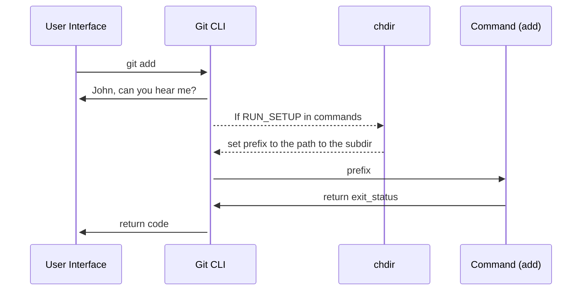

In this document, we will learn how to add a command to Git's CLI.

# Runtime Environment

Git subcommands are standalone executables that live in the Git exec path, normally `/usr/lib/git-core`. The `git` executable itself is a thin wrapper that knows where the subcommands live, and runs them by passing command-line arguments to them.

# Adding a new command

<br/>

Every command has a file with a corresponding name, within the `📄 my_builtin` folder.

This file includes the definition of the command (in this case `cmd_add`<swm-token data-swm-token=":my_builtin/add.c:475:2:2:`int cmd_add(int argc, const char **argv, const char *prefix)`"/>:
<!-- NOTE-swimm-snippet: the lines below link your snippet to Swimm -->
### 📄 my_builtin/add.c
```c
⬜ 472    	return exit_status;
⬜ 473    }
⬜ 474    
🟩 475    int cmd_add(int argc, const char **argv, const char *prefix)
🟩 476    {
🟩 477    	int exit_status = 0;
🟩 478    	struct pathspec pathspec;
⬜ 479    	struct dir_struct dir = DIR_INIT;
⬜ 480    	int flags;
⬜ 481    	int add_new_files;
```

<br/>

The function must be declared within `📄 builtin.h`:
<!-- NOTE-swimm-snippet: the lines below link your snippet to Swimm -->
### 📄 builtin.h
```c
⬜ 111    
⬜ 112    int is_builtin(const char *s);
⬜ 113    
🟩 114    int cmd_add(int argc, const char **argv, const char *prefix);
⬜ 115    int cmd_am(int argc, const char **argv, const char *prefix);
⬜ 116    int cmd_annotate(int argc, const char **argv, const char *prefix);
⬜ 117    int cmd_apply(int argc, const char **argv, const char *prefix);
```

<br/>

To make Git “aware” of the `add`<swm-token data-swm-token=":git.c:485:4:4:`	{ &quot;add&quot;, cmd_add, RUN_SETUP | NEED_WORK_TREE },`"/> command, it needs to be registered by adding a `cmd_struct`<swm-token data-swm-token=":git.c:484:4:4:`static struct cmd_struct commands[] = {`"/> to the `commands`<swm-token data-swm-token=":git.c:484:6:6:`static struct cmd_struct commands[] = {`"/> array:
<!-- NOTE-swimm-snippet: the lines below link your snippet to Swimm -->
### 📄 git.c
```c
⬜ 481    	return 0;
⬜ 482    }
⬜ 483    
🟩 484    static struct cmd_struct commands[] = {
🟩 485    	{ "add", cmd_add, RUN_SETUP | NEED_WORK_TREE },
⬜ 486    	{ "am", cmd_am, RUN_SETUP | NEED_WORK_TREE },
⬜ 487    	{ "annotate", cmd_annotate, RUN_SETUP | NO_PARSEOPT },
⬜ 488    	{ "apply", cmd_apply, RUN_SETUP_GENTLY },
```

<br/>

This is the array of commands `commands[]`<swm-token data-swm-token=":git.c:484:6:8:`static struct cmd_struct commands[] = {`"/>

<br/>

Also, in order to be able to build the project, we must add our command into the `BUILTIN_OBJS`<swm-token data-swm-token=":Makefile:1063:0:0:`BUILTIN_OBJS += builtin/add.o`"/> within the `📄 Makefile`:
<!-- NOTE-swimm-snippet: the lines below link your snippet to Swimm -->
### 📄 Makefile
```
🟩 1063   BUILTIN_OBJS += builtin/add.o
```

<br/>

# Tests

You must have a test, written to report in TAP (Test Anything Protocol). Tests are executables (usually shell scripts) that live in the `📄 t`subdirectory of the tree. Each test name begins with `t` and a sequence number that controls where in the test sequence it will be executed.

<br/>

<br/>

This is an example of a test for the `cmd_add`<swm-token data-swm-token=":builtin.h:114:2:2:`int cmd_add(int argc, const char **argv, const char *prefix);`"/> command:
<!-- NOTE-swimm-snippet: the lines below link your snippet to Swimm -->
### 📄 t/t3700-add.sh
```shell
🟩 429    test_expect_success 'no file status change if no pathspec is given' '
🟩 430    	>foo5 &&
🟩 431    	>foo6 &&
🟩 432    	git add foo5 foo6 &&
🟩 433    	git add --chmod=+x &&
🟩 434    	test_mode_in_index 100644 foo5 &&
🟩 435    	test_mode_in_index 100644 foo6
```

<br/>

# Show your command

<br/>

In `📄 command-list.txt` we categorize commands by type, so they can be listed in appropriate subsections in the documentation's summary command list. Add an entry for yours.
<!-- NOTE-swimm-snippet: the lines below link your snippet to Swimm -->
### 📄 command-list.txt
```text
🟩 47     # command name                          category [category] [category]
🟩 48     git-add                                 mainporcelain           worktree
```

<br/>

# How your new command is called

The implementation commands take three parameters: `argc`<swm-token data-swm-token=":my_builtin/add.c:475:6:6:`int cmd_add(int argc, const char **argv, const char *prefix)`"/>, `argv`<swm-token data-swm-token=":builtin.h:114:14:14:`int cmd_add(int argc, const char **argv, const char *prefix);`"/>, and `prefix`<swm-token data-swm-token=":builtin.h:114:22:22:`int cmd_add(int argc, const char **argv, const char *prefix);`"/>. The first two are similar to what `main()` of a standalone command would be called with.

When `RUN_SETUP`<swm-token data-swm-token=":git.c:485:11:11:`	{ &quot;add&quot;, cmd_add, RUN_SETUP | NEED_WORK_TREE },`"/> is specified in the `commands`<swm-token data-swm-token=":git.c:484:6:6:`static struct cmd_struct commands[] = {`"/> table, and when you were started from a subdirectory of the work tree, your new command (e.g., `cmd_add`<swm-token data-swm-token=":builtin.h:114:2:2:`int cmd_add(int argc, const char **argv, const char *prefix);`"/> is called after `chdir` to the top of the work tree, and `prefix`<swm-token data-swm-token=":my_builtin/add.c:475:22:22:`int cmd_add(int argc, const char **argv, const char *prefix)`"/> gets the path to the subdirectory the command started from. This allows you to convert a user-supplied pathname (typically relative to that directory) to a pathname relative to the top of the work tree.

The return value from the function becomes the exit status of the command.

<br/>

<!--MERMAID {width:100}-->

<!--MCONTENT {content: sequenceDiagram<br/>
User Interface->>+Git CLI: git `add`<swm-token data-swm-token=":git.c:485:4:4:`	{ &quot;add&quot;, cmd_add, RUN_SETUP | NEED_WORK_TREE },`"/><br/>
Git CLI->>+User Interface: John, can you hear me?<br/>
Git CLI\-\-\>>chdir: If `RUN_SETUP`<swm-token data-swm-token=":git.c:485:11:11:`	{ &quot;add&quot;, cmd_add, RUN_SETUP | NEED_WORK_TREE },`"/> in `commands`<swm-token data-swm-token=":git.c:484:6:6:`static struct cmd_struct commands[] = {`"/><br/>
chdir\-\-\>>Git CLI: set `prefix`<swm-token data-swm-token=":builtin.h:114:22:22:`int cmd_add(int argc, const char **argv, const char *prefix);`"/> to the path to the subdir<br/>
Git CLI->>Command (add): `prefix`<swm-token data-swm-token=":builtin.h:114:22:22:`int cmd_add(int argc, const char **argv, const char *prefix);`"/><br/>
Command (add)->>Git CLI: return `exit_status`<swm-token data-swm-token=":my_builtin/add.c:472:3:3:`	return exit_status;`"/><br/>
Git CLI->>+User Interface: return code} --->

<br/>

This file was generated by Swimm. [Click here to view it in the app](https://swimm-web-app.web.app/repos/Z2l0aHViJTNBJTNBZ2l0LXNyYy1wbGF5Z3JvdW5kJTNBJTNBT21lclJvc2VuYmF1bQ==/docs/JLzge).