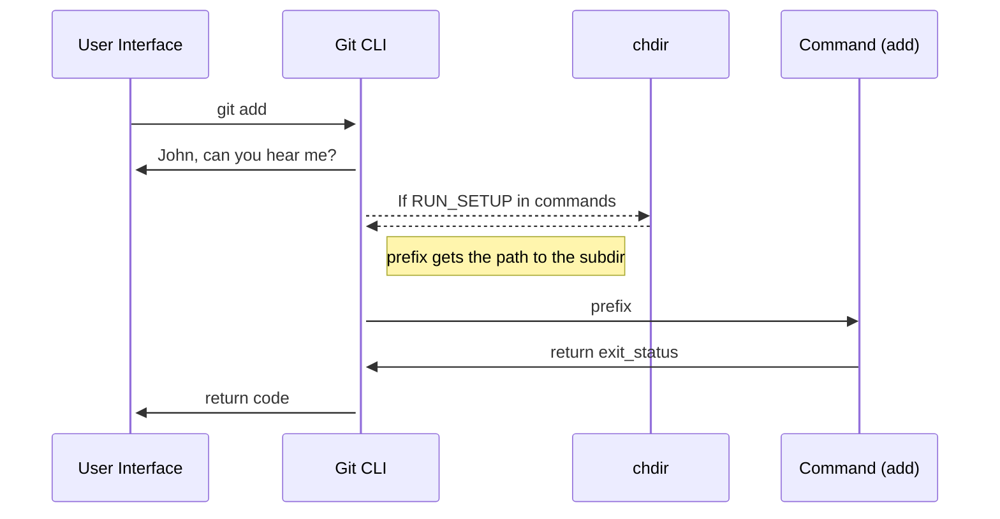

In this document, we will learn how to add a command to Git's CLI.

# Runtime Environment

Git subcommands are standalone executables that live in the Git exec path, normally `/usr/lib/git-core`. The `git` executable itself is a thin wrapper that knows where the subcommands live, and runs them by passing command-line arguments to them.

<br/>

# Adding a new command

<br/>

Every command has a file with a corresponding name, within the `📄 my_builtin` folder.

This file includes the definition of the command (in this case `cmd_add`[<sup id="WW3dt">↓</sup>](#f-WW3dt)):
<!-- NOTE-swimm-snippet: the lines below link your snippet to Swimm -->
### 📄 my_builtin/add.c
```c
⬜ 472    	return exit_status;
⬜ 473    }
⬜ 474    
🟩 475    int cmd_add(int argc, const char **argv, const char *prefix)
🟩 476    {
🟩 477    	int exit_status = 0;
🟩 478    	struct pathspec pathspec;
⬜ 479    	struct dir_struct dir = DIR_INIT;
⬜ 480    	int flags;
⬜ 481    	int add_new_files;
```

<br/>

The function must be declared within `📄 builtin.h`:
<!-- NOTE-swimm-snippet: the lines below link your snippet to Swimm -->
### 📄 builtin.h
```c
⬜ 111    
⬜ 112    int is_builtin(const char *s);
⬜ 113    
🟩 114    int cmd_add(int argc, const char **argv, const char *prefix);
⬜ 115    int cmd_am(int argc, const char **argv, const char *prefix);
⬜ 116    int cmd_annotate(int argc, const char **argv, const char *prefix);
⬜ 117    int cmd_apply(int argc, const char **argv, const char *prefix);
```

<br/>

To make Git “aware” of the `add`[<sup id="ZY0bfT">↓</sup>](#f-ZY0bfT) command, it needs to be registered by adding a `cmd_struct`[<sup id="Z2nx8xA">↓</sup>](#f-Z2nx8xA) to the `commands`[<sup id="ZAY7QK">↓</sup>](#f-ZAY7QK) array:
<!-- NOTE-swimm-snippet: the lines below link your snippet to Swimm -->
### 📄 git.c
```c
⬜ 481    	return 0;
⬜ 482    }
⬜ 483    
🟩 484    static struct cmd_struct commands[] = {
🟩 485    	{ "add", cmd_add, RUN_SETUP | NEED_WORK_TREE },
⬜ 486    	{ "am", cmd_am, RUN_SETUP | NEED_WORK_TREE },
⬜ 487    	{ "annotate", cmd_annotate, RUN_SETUP | NO_PARSEOPT },
⬜ 488    	{ "apply", cmd_apply, RUN_SETUP_GENTLY },
```

<br/>

<br/>

<br/>

Also, in order to be able to build the project, we must add our command into the `BUILTIN_OBJS`[<sup id="ifJTN">↓</sup>](#f-ifJTN) within the `📄 Makefile`:
<!-- NOTE-swimm-snippet: the lines below link your snippet to Swimm -->
### 📄 Makefile
```
🟩 1063   BUILTIN_OBJS += builtin/add.o
```

<br/>

# Tests

You must have a test, written to report in TAP (Test Anything Protocol). Tests are executables (usually shell scripts) that live in the `📄 t`subdirectory of the tree. Each test name begins with `t` and a sequence number that controls where in the test sequence it will be executed.

<br/>

<br/>

This is an example of a test for the `cmd_add`[<sup id="Olher">↓</sup>](#f-Olher) command:
<!-- NOTE-swimm-snippet: the lines below link your snippet to Swimm -->
### 📄 t/t3700-add.sh
```shell
🟩 429    test_expect_success 'no file status change if no pathspec is given' '
🟩 430    	>foo5 &&
🟩 431    	>foo6 &&
🟩 432    	git add foo5 foo6 &&
🟩 433    	git add --chmod=+x &&
🟩 434    	test_mode_in_index 100644 foo5 &&
🟩 435    	test_mode_in_index 100644 foo6
```

<br/>

# Show your command

<br/>

In `📄 command-list.txt` we categorize commands by type, so they can be listed in appropriate subsections in the documentation's summary command list. Add an entry for yours.
<!-- NOTE-swimm-snippet: the lines below link your snippet to Swimm -->
### 📄 command-list.txt
```text
🟩 47     # command name                          category [category] [category]
🟩 48     git-add                                 mainporcelain           worktree
```

<br/>

# How your new command is called

The implementation commands take three parameters: `argc`[<sup id="Z2uPrig">↓</sup>](#f-Z2uPrig), `argv`[<sup id="Z2bCEPR">↓</sup>](#f-Z2bCEPR), and `prefix`[<sup id="2bcG0g">↓</sup>](#f-2bcG0g). The first two are similar to what `main()` of a standalone command would be called with.

When `RUN_SETUP`[<sup id="Z1BE9pN">↓</sup>](#f-Z1BE9pN) is specified in the `commands[]`[<sup id="Z1wOyO">↓</sup>](#f-Z1wOyO) table, and when you were started from a subdirectory of the work tree, your new command (e.g., `cmd_add`[<sup id="Olher">↓</sup>](#f-Olher)) is called after `chdir` to the top of the work tree, and `prefix`[<sup id="Z2sEcOl">↓</sup>](#f-Z2sEcOl) gets the path to the subdirectory the command started from. This allows you to convert a user-supplied pathname (typically relative to that directory) to a pathname relative to the top of the work tree.

The return value from the function becomes the exit status of the command.

<br/>

<br/>

<!--MERMAID {width:100}-->

<!--MCONTENT {content: "sequenceDiagram<br/>\nUser Interface->>+Git CLI: git `add`[<sup id=\"ZY0bfT\">↓</sup>](#f-ZY0bfT)<br/>\nGit CLI->>+User Interface: John, can you hear me?<br/>\nGit CLI\\-\\-\\>>chdir: If `RUN_SETUP`[<sup id=\"Z1BE9pN\">↓</sup>](#f-Z1BE9pN) in `commands`[<sup id=\"ZAY7QK\">↓</sup>](#f-ZAY7QK)<br/>\nchdir\\-\\-\\>>Git CLI:<br/>\nNote right of Git CLI: `prefix`[<sup id=\"2bcG0g\">↓</sup>](#f-2bcG0g) gets the path to the subdir<br/>\nGit CLI->>Command (add): `prefix`[<sup id=\"2bcG0g\">↓</sup>](#f-2bcG0g)<br/>\nCommand (add)->>Git CLI: return `exit_status`[<sup id=\"25O6Qg\">↓</sup>](#f-25O6Qg)<br/>\nGit CLI->>+User Interface: return code"} --->

<br/>

<!-- THIS IS AN AUTOGENERATED SECTION. DO NOT EDIT THIS SECTION DIRECTLY -->
### Swimm Note

<span id="f-ZY0bfT">add</span>[^](#ZY0bfT) - "git.c" L485
```c
	{ "add", cmd_add, RUN_SETUP | NEED_WORK_TREE },
```

<span id="f-Z2uPrig">argc</span>[^](#Z2uPrig) - "my_builtin/add.c" L475
```c
int cmd_add(int argc, const char **argv, const char *prefix)
```

<span id="f-Z2bCEPR">argv</span>[^](#Z2bCEPR) - "builtin.h" L114
```c
int cmd_add(int argc, const char **argv, const char *prefix);
```

<span id="f-ifJTN">BUILTIN_OBJS</span>[^](#ifJTN) - "Makefile" L1063
```
BUILTIN_OBJS += builtin/add.o
```

<span id="f-WW3dt">cmd_add</span>[^](#WW3dt) - "my_builtin/add.c" L475
```c
int cmd_add(int argc, const char **argv, const char *prefix)
```

<span id="f-Olher">cmd_add</span>[^](#Olher) - "builtin.h" L114
```c
int cmd_add(int argc, const char **argv, const char *prefix);
```

<span id="f-Z2nx8xA">cmd_struct</span>[^](#Z2nx8xA) - "git.c" L484
```c
static struct cmd_struct commands[] = {
```

<span id="f-ZAY7QK">commands</span>[^](#ZAY7QK) - "git.c" L484
```c
static struct cmd_struct commands[] = {
```

<span id="f-Z1wOyO">commands[]</span>[^](#Z1wOyO) - "git.c" L484
```c
static struct cmd_struct commands[] = {
```

<span id="f-25O6Qg">exit_status</span>[^](#25O6Qg) - "my_builtin/add.c" L472
```c
	return exit_status;
```

<span id="f-2bcG0g">prefix</span>[^](#2bcG0g) - "builtin.h" L114
```c
int cmd_add(int argc, const char **argv, const char *prefix);
```

<span id="f-Z2sEcOl">prefix</span>[^](#Z2sEcOl) - "my_builtin/add.c" L475
```c
int cmd_add(int argc, const char **argv, const char *prefix)
```

<span id="f-Z1BE9pN">RUN_SETUP</span>[^](#Z1BE9pN) - "git.c" L485
```c
	{ "add", cmd_add, RUN_SETUP | NEED_WORK_TREE },
```

<br/>

This file was generated by Swimm. [Click here to view it in the app](https://swimm-web-app.web.app/repos/Z2l0aHViJTNBJTNBZ2l0LXNyYy1wbGF5Z3JvdW5kJTNBJTNBT21lclJvc2VuYmF1bQ==/docs/JLzge).