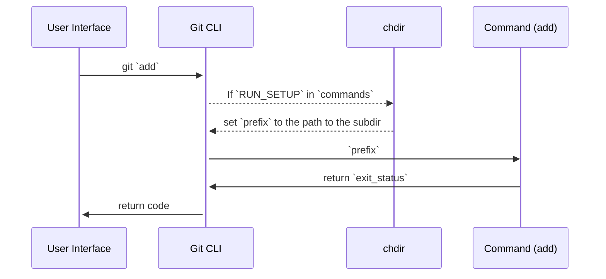

In this document, we will learn how data is sent to and from Git's CLI.

# Commands and definitions

<br/>

The git commands must be declared within `📄 builtin.h`, for example:
<!-- NOTE-swimm-snippet: the lines below link your snippet to Swimm -->
### 📄 builtin.h
```c
⬜ 111    
⬜ 112    int is_builtin(const char *s);
⬜ 113    
🟩 114    int cmd_add(int argc, const char **argv, const char *prefix);
🟩 115    int cmd_am(int argc, const char **argv, const char *prefix);
🟩 116    int cmd_annotate(int argc, const char **argv, const char *prefix);
🟩 117    int cmd_apply(int argc, const char **argv, const char *prefix);
🟩 118    int cmd_archive(int argc, const char **argv, const char *prefix);
🟩 119    int cmd_bisect__helper(int argc, const char **argv, const char *prefix);
🟩 120    int cmd_blame(int argc, const char **argv, const char *prefix);
⬜ 121    int cmd_branch(int argc, const char **argv, const char *prefix);
⬜ 122    int cmd_bugreport(int argc, const char **argv, const char *prefix);
⬜ 123    int cmd_bundle(int argc, const char **argv, const char *prefix);
```

<br/>

# How your commands are called

The implementation commands take three parameters: `argc`<swm-token data-swm-token=":my_builtin/add.c:475:6:6:`int cmd_add(int argc, const char **argv, const char *prefix)`"/>, `argv`<swm-token data-swm-token=":builtin.h:114:14:14:`int cmd_add(int argc, const char **argv, const char *prefix);`"/>, and `prefix`<swm-token data-swm-token=":builtin.h:114:22:22:`int cmd_add(int argc, const char **argv, const char *prefix);`"/>. The first two are similar to what `main()` of a standalone command would be called with.

When `RUN_SETUP`<swm-token data-swm-token=":git.c:485:11:11:`	{ &quot;add&quot;, cmd_add, RUN_SETUP | NEED_WORK_TREE },`"/> is specified in the `commands`<swm-token data-swm-token=":git.c:484:6:6:`static struct cmd_struct commands[] = {`"/> table, and when you were started from a subdirectory of the work tree, your new command (e.g., `cmd_add`<swm-token data-swm-token=":builtin.h:114:2:2:`int cmd_add(int argc, const char **argv, const char *prefix);`"/> is called after `chdir` to the top of the work tree, and `prefix`<swm-token data-swm-token=":my_builtin/add.c:475:22:22:`int cmd_add(int argc, const char **argv, const char *prefix)`"/> gets the path to the subdirectory the command started from. This allows you to convert a user-supplied pathname (typically relative to that directory) to a pathname relative to the top of the work tree.

The return value from the function becomes the exit status of the command.

<br/>

<!--MERMAID {width:100}-->

<!--MCONTENT {content: "sequenceDiagram<br/>\nUser Interface->>+Git CLI: git `add`<swm-token data-swm-token=\":git.c:485:4:4:`\t{ &quot;add&quot;, cmd_add, RUN_SETUP | NEED_WORK_TREE },`\"/><br/>\nGit CLI\\-\\-\\>>chdir: If `RUN_SETUP`<swm-token data-swm-token=\":git.c:485:11:11:`\t{ &quot;add&quot;, cmd_add, RUN_SETUP | NEED_WORK_TREE },`\"/> in `commands`<swm-token data-swm-token=\":git.c:484:6:6:`static struct cmd_struct commands[] = {`\"/><br/>\nchdir\\-\\-\\>>Git CLI: set `prefix`<swm-token data-swm-token=\":builtin.h:114:22:22:`int cmd_add(int argc, const char **argv, const char *prefix);`\"/> to the path to the subdir<br/>\nGit CLI->>Command (add): `prefix`<swm-token data-swm-token=\":builtin.h:114:22:22:`int cmd_add(int argc, const char **argv, const char *prefix);`\"/><br/>\nCommand (add)->>Git CLI: return `exit_status`<swm-token data-swm-token=\":my_builtin/add.c:472:3:3:`\treturn exit_status;`\"/><br/>\nGit CLI->>+User Interface: return code"} --->

<br/>

To make Git “aware” of the `add`<swm-token data-swm-token=":git.c:485:4:4:`	{ &quot;add&quot;, cmd_add, RUN_SETUP | NEED_WORK_TREE },`"/> command, it needs to be registered by adding a `cmd_struct`<swm-token data-swm-token=":git.c:484:4:4:`static struct cmd_struct commands[] = {`"/> to the `commands`<swm-token data-swm-token=":git.c:484:6:6:`static struct cmd_struct commands[] = {`"/> array:
<!-- NOTE-swimm-snippet: the lines below link your snippet to Swimm -->
### 📄 git.c
```c
⬜ 481    	return 0;
⬜ 482    }
⬜ 483    
🟩 484    static struct cmd_struct commands[] = {
🟩 485    	{ "add", cmd_add, RUN_SETUP | NEED_WORK_TREE },
⬜ 486    	{ "am", cmd_am, RUN_SETUP | NEED_WORK_TREE },
⬜ 487    	{ "annotate", cmd_annotate, RUN_SETUP | NO_PARSEOPT },
⬜ 488    	{ "apply", cmd_apply, RUN_SETUP_GENTLY },
```

<br/>

This file was generated by Swimm. [Click here to view it in the app](https://app.swimm.io/repos/Z2l0aHViJTNBJTNBZ2l0LXNyYy1wbGF5Z3JvdW5kJTNBJTNBT21lclJvc2VuYmF1bQ==/docs/vvxtv).
