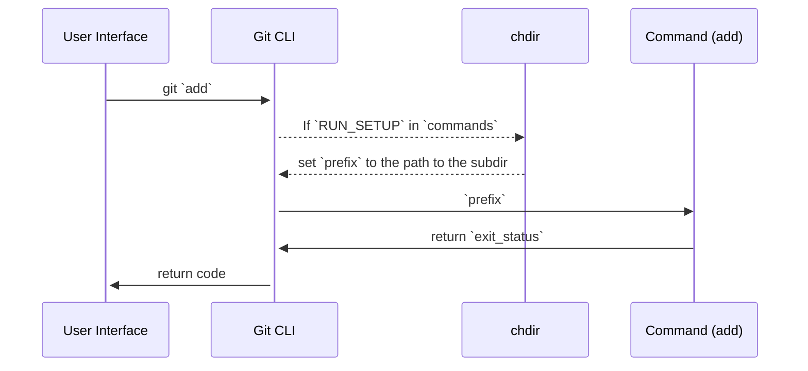

In this document, we will learn how to add a command to Git's CLI.

<br/>

Every command has a file with a corresponding name, within the `📄 my_builtin` folder.

This file includes the definition of the command (in this case `cmd_add`<swm-token data-swm-token=":my_builtin/add.c:475:2:2:`int cmd_add(int argc, const char **argv, const char *prefix)`"/>:
<!-- NOTE-swimm-snippet: the lines below link your snippet to Swimm -->
### 📄 my_builtin/add.c
```c
475    int cmd_add(int argc, const char **argv, const char *prefix)
476    {
477    	int exit_status = 0;
478    	struct pathspec pathspec;
```

<br/>

The function must be declared within `📄 builtin.h`:
<!-- NOTE-swimm-snippet: the lines below link your snippet to Swimm -->
### 📄 builtin.h
```c
114    int cmd_add(int argc, const char **argv, const char *prefix);
```

<br/>

To make Git “aware” of the `add`<swm-token data-swm-token=":git.c:485:4:4:`	{ &quot;add&quot;, cmd_add, RUN_SETUP | NEED_WORK_TREE },`"/> command, it needs to be registered by adding a `cmd_struct`<swm-token data-swm-token=":git.c:484:4:4:`static struct cmd_struct commands[] = {`"/> to the `commands`<swm-token data-swm-token=":git.c:484:6:6:`static struct cmd_struct commands[] = {`"/> array:
<!-- NOTE-swimm-snippet: the lines below link your snippet to Swimm -->
### 📄 git.c
```c
484    static struct cmd_struct commands[] = {
485    	{ "add", cmd_add, RUN_SETUP | NEED_WORK_TREE },
```

<br/>

<!--MERMAID {width:100}-->

<!--MCONTENT {content: "sequenceDiagram<br/>\nUser Interface->>+Git CLI: git `add`<swm-token data-swm-token=\":git.c:485:4:4:`\t{ &quot;add&quot;, cmd_add, RUN_SETUP | NEED_WORK_TREE },`\"/><br/>\nGit CLI\\-\\-\\>>chdir: If `RUN_SETUP`<swm-token data-swm-token=\":git.c:485:11:11:`\t{ &quot;add&quot;, cmd_add, RUN_SETUP | NEED_WORK_TREE },`\"/> in `commands`<swm-token data-swm-token=\":git.c:484:6:6:`static struct cmd_struct commands[] = {`\"/><br/>\nchdir\\-\\-\\>>Git CLI: set `prefix`<swm-token data-swm-token=\":builtin.h:114:22:22:`int cmd_add(int argc, const char **argv, const char *prefix);`\"/> to the path to the subdir<br/>\nGit CLI->>Command (add): `prefix`<swm-token data-swm-token=\":builtin.h:114:22:22:`int cmd_add(int argc, const char **argv, const char *prefix);`\"/><br/>\nCommand (add)->>Git CLI: return `exit_status`<swm-token data-swm-token=\":my_builtin/add.c:472:3:3:`\treturn exit_status;`\"/><br/>\nGit CLI->>+User Interface: return code"} --->

<br/>

This file was generated by Swimm. [Click here to view it in the app](https://app.swimm.io/repos/Z2l0aHViJTNBJTNBZ2l0LXNyYy1wbGF5Z3JvdW5kJTNBJTNBT21lclJvc2VuYmF1bQ==/docs/xafm6u28).
